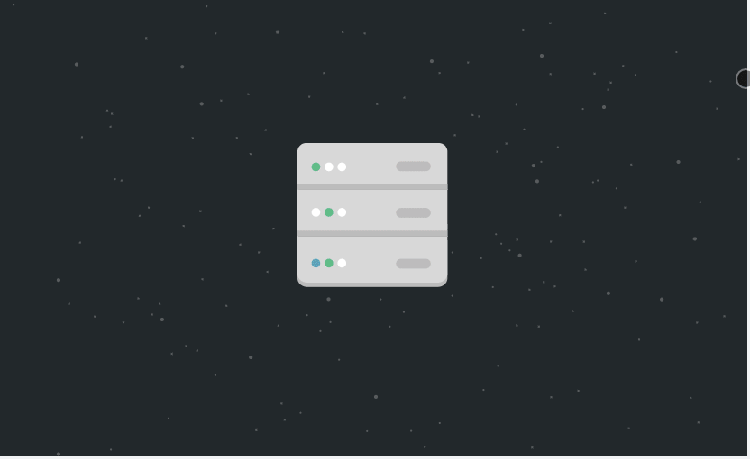

<h1> Hello, Clarice. </h1>

<h2>This is a <strong> copy</strong>: https://codesandbox.io/s/h1rrv </h2>

The only purpose here is to study how the <strong>@react-spring/parallax </strong> plugin works. https://github.com/pmndrs/react-spring

<h4>This is supposed to be like this:</h4>

Very cool, right?

In the project directory, you can run:

### `yarn start`

Runs the app in the development mode.\
Open [http://localhost:3000](http://localhost:3000) to view it in the browser.

